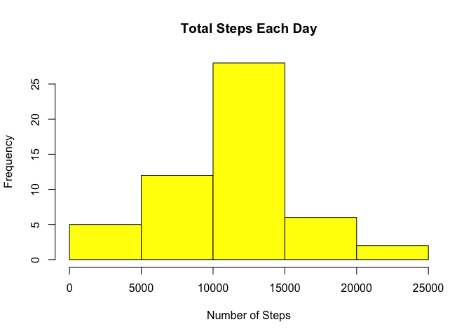
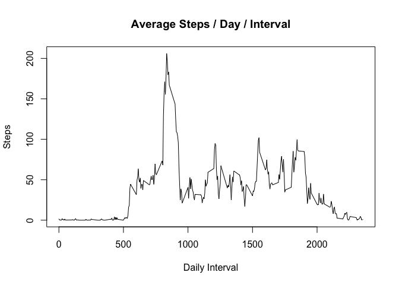
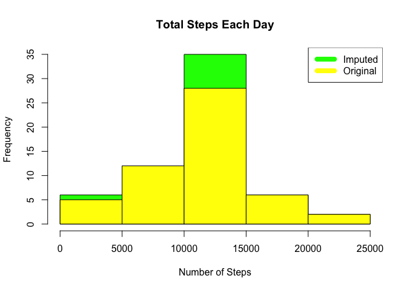
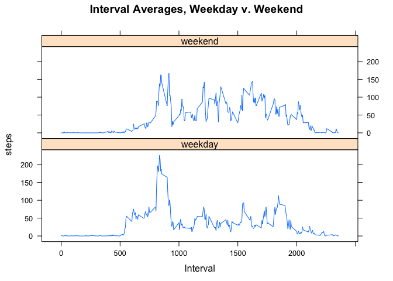

## Introduction

It is now possible to collect a large amount of data about personal
movement using activity monitoring devices such as a
[Fitbit](http://www.fitbit.com), [Nike
Fuelband](http://www.nike.com/us/en_us/c/nikeplus-fuelband), or
[Jawbone Up](https://jawbone.com/up). These type of devices are part of
the "quantified self" movement -- a group of enthusiasts who take
measurements about themselves regularly to improve their health, to
find patterns in their behavior, or because they are tech geeks. But
these data remain under-utilized both because the raw data are hard to
obtain and there is a lack of statistical methods and software for
processing and interpreting the data.

This assignment makes use of data from a personal activity monitoring
device. This device collects data at 5 minute intervals through out the
day. The data consists of two months of data from an anonymous
individual collected during the months of October and November, 2012
and include the number of steps taken in 5 minute intervals each day.

## Data

The data for this assignment can be downloaded from the course web
site:

* Dataset: [Activity monitoring data](https://d396qusza40orc.cloudfront.net/repdata%2Fdata%2Factivity.zip) [52K]

The variables included in this dataset are:

* **steps**: Number of steps taking in a 5-minute interval (missing
    values are coded as `NA`)

* **date**: The date on which the measurement was taken in YYYY-MM-DD
    format

* **interval**: Identifier for the 5-minute interval in which
    measurement was taken


The dataset is stored in a comma-separated-value (CSV) file and there
are a total of 17,568 observations in this
dataset.

## Loading and preprocessing the data
Ensure the downloaded zip-file is in the current working directory.

```r
if(!file.exists("getdata-projectfiles-UCI HAR Dataset.zip")) {
        temp <- tempfile()
        download.file("http://d396qusza40orc.cloudfront.net/repdata%2Fdata%2Factivity.zip",temp)
        unzip(temp)
        unlink(temp)
}
#zipF<-"repdata%2Fdata%2Factivity.zip"
#unzip(zipF,exdir=".")
df <- read.csv("activity.csv", header=T, quote="\"", sep=",")
```

## What is mean total number of steps taken per day?
To determine this, aggregate all intervals by date and sum the steps and plot.  Also, check the daily mean and median steps across all dates.

```r
totalStepsByDate <- aggregate(steps ~ date, df, sum)
hist(totalStepsByDate$steps, main = paste("Total Steps Each Day"), col="yellow", xlab="Number of Steps")
```

<!-- -->

```r
dailyMean <- mean(totalStepsByDate$steps)
print(paste("Daily Mean",dailyMean))
```

```
## [1] "Daily Mean 10766.1886792453"
```

```r
dailyMedian <- median(totalStepsByDate$steps)
print(paste("Daily Median",dailyMedian))
```

```
## [1] "Daily Median 10765"
```

## What is the average daily activity pattern?
To determine this, aggregate the measurements by interval and average the steps; then plot.

```r
stepsByInterval <- aggregate(steps ~ interval, df, mean)
plot(stepsByInterval$interval,stepsByInterval$steps, type="l", xlab="Daily Interval", ylab="Steps",main="Average Steps / Day / Interval")
```

<!-- -->

```r
max_interval <- stepsByInterval[which.max(stepsByInterval$steps),1]
print(max_interval)
```

```
## [1] 835
```

## Imputing missing values
To determine the count of missing values, sum the number of records where NOT complete cases.
To impute missing measurements, set a missing day-interval's value to the average for that same interval across all days.
For the first day, which was all NA's, set all to zero (rather than the method above for each day-1 interval).  This is reasonable as it is in-line with day-2's similarly low values.
Note the updated average mean and median across all intervals.

```r
naCount <- sum(!complete.cases(df))
print(naCount)
```

```
## [1] 2304
```

```r
imputedData <- transform(df, steps = ifelse(is.na(df$steps), stepsByInterval$steps[match(df$interval, stepsByInterval$interval)], df$steps))
imputedData[as.character(imputedData$date) == "2012-10-01", 1] <- 0
imputedStepsByDate <- aggregate(steps ~ date, imputedData, sum)
hist(imputedStepsByDate$steps, main = paste("Total Steps Each Day"), col=rgb(0,1,0), xlab="Number of Steps")
hist(totalStepsByDate$steps, main = paste("Total Steps Each Day"), col=rgb(1,1,0), xlab="Number of Steps", add=TRUE)
legend("topright", c("Imputed", "Original"), col=c("green", "yellow"), lwd=8)
```

<!-- -->

```r
imputedMean <- mean(totalStepsByDate$steps)
print(imputedMean)
```

```
## [1] 10766.19
```

```r
imputedMedian <- median(totalStepsByDate$steps)
print(imputedMedian)
```

```
## [1] 10765
```

## Are there differences in activity patterns between weekdays and weekends?
To determine this, add a factor to each date's record reflecting whether that day of the week is a weekday or weekend.
Plot the resulting split aggregates in a 2-up conditioning plot.

```r
library(lattice)
imputedData$dayFactor <- as.factor(ifelse(weekdays(as.Date(imputedData$date))=="Saturday" | weekdays(as.Date(imputedData$date))=="Sunday", "weekend", "weekday"))
aggregateImputedData <- aggregate(steps~interval+dayFactor, imputedData, mean)
xyplot(steps~interval|dayFactor,
       data=aggregateImputedData,
       main="Interval Averages, Weekday v. Weekend",
       xlab="Interval",
       layout=c(1,2),
       type="l")
```

<!-- -->
